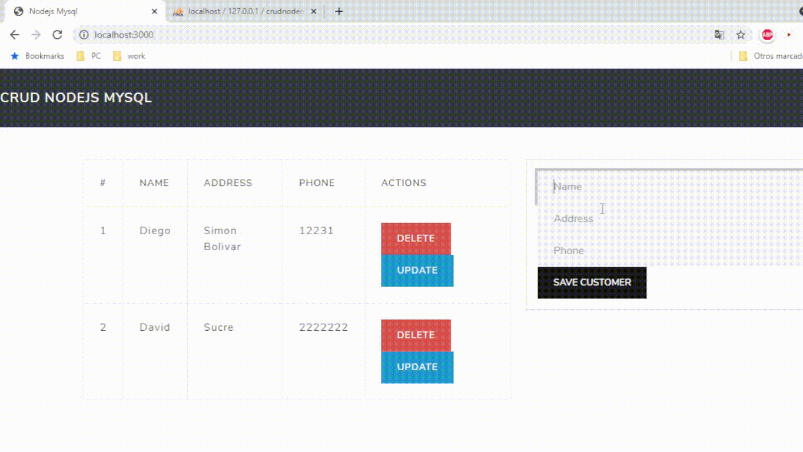
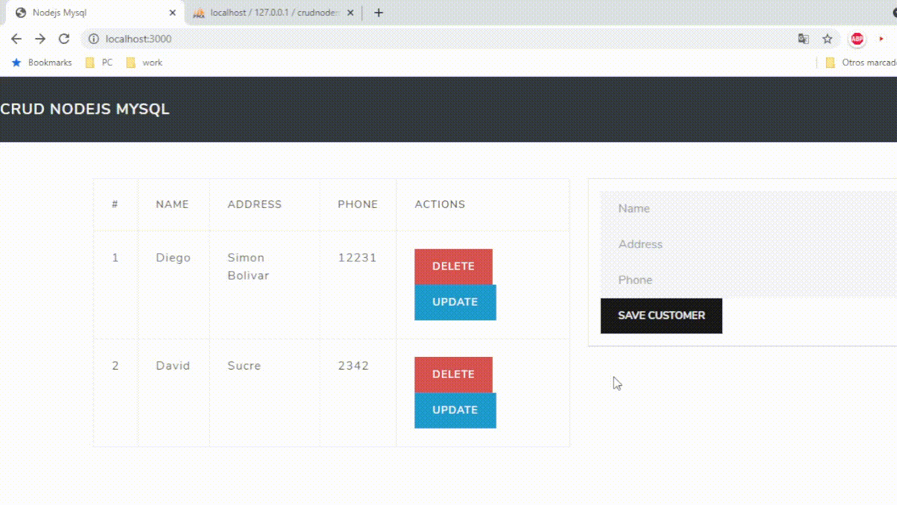
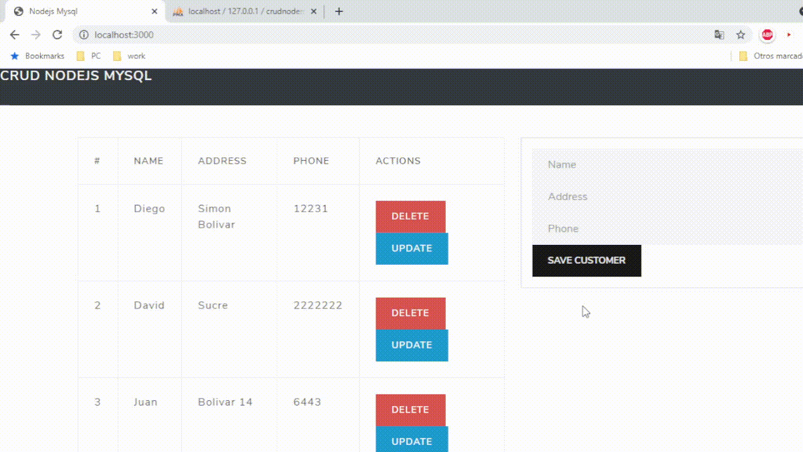

# CRUD Nodejs Mysql

- Create database
- Configure in src/app.js
- Import script from database/db.sql
- npm install
- node src/app

## ADD customer 

	

## UPDATE customer

	

## DELETE customer 

	

